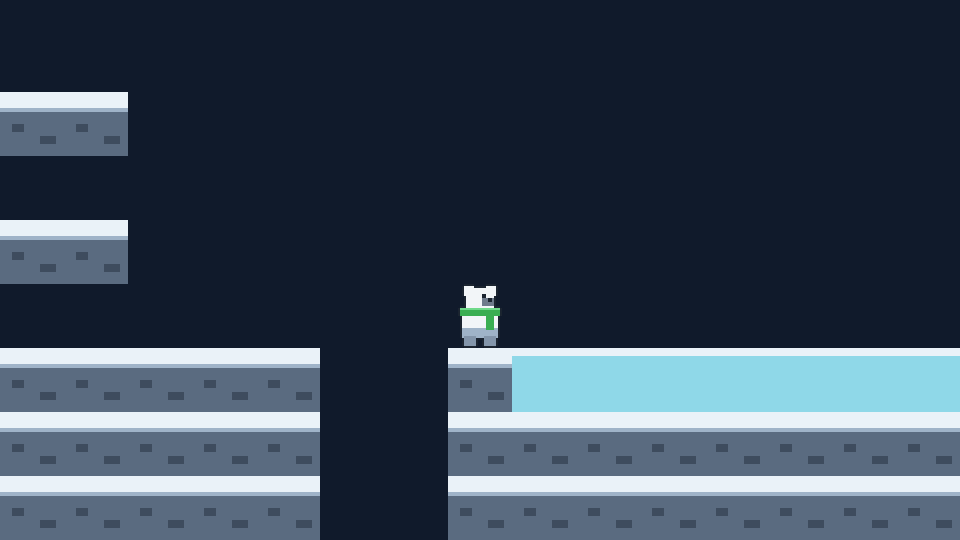
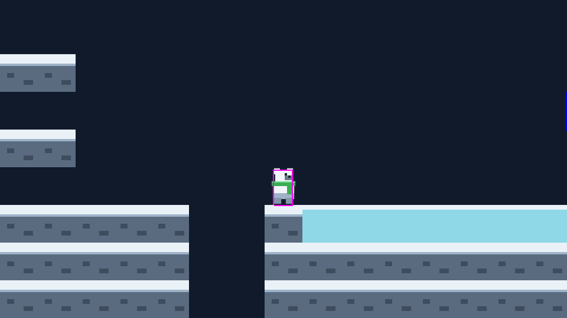
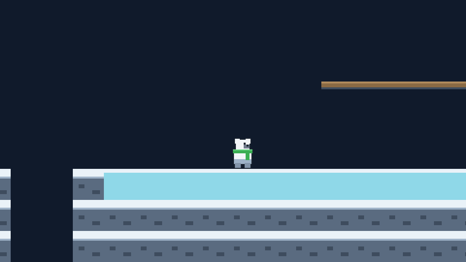

# Polar Adventures

A 16-bit arctic platformer. Phaser 4 · TypeScript · Vite.

### ▶ [Play the current build](https://yakov.khalinsky.com/polar-adventures/)



## Status: movement prototype

Milestones 1–2. There is one hand-authored test level, no enemies, no
collectibles and no goal. What exists is a hero that is genuinely good to
control, and one mechanic — ice — that changes how it moves. The feel of both is
*measured* rather than asserted.

> "It boots" says nothing about whether the jump is 3.5 tiles.

| Controls | |
|---|---|
| Move | <kbd>←</kbd> <kbd>→</kbd> |
| Jump | <kbd>↑</kbd> <kbd>Space</kbd> <kbd>Z</kbd> <kbd>X</kbd> |
| Physics debug overlay | <kbd>F1</kbd> |

Hold jump to go higher, tap it to hop. Both are deliberate — see below.

## The jump is derived, not tuned

`src/config/movement.ts` holds two design targets, and everything vertical is
computed from them:

```
JUMP_HEIGHT_PX = 3.5 tiles     APEX_TIME_S = 0.40
        ↓
GRAVITY_RISE = 2h/t²   JUMP_VELOCITY = 2h/t
```

Nothing is hand-edited independently, so the arc cannot silently stop matching
its stated apex. Feel is then layered on top: asymmetric gravity (fall is 1.64×
rise — that ratio *is* the sense of weight), coyote time, a jump buffer, and
variable height via a velocity **clamp** rather than a multiplier, because a
clamp guarantees a minimum hop while a multiplier's result depends on when you
happened to release.

One subtlety worth knowing: Phaser integrates with semi-implicit Euler at a
fixed 60 Hz, so the closed-form 112px target lands at **107.3px** in the running
game. The constants stay as readable design intent and the gap is documented and
asserted, rather than the constant being fudged to compensate.



*The debug overlay (<kbd>F1</kbd>). The hero's hitbox is deliberately narrower
than its art so it fits through one-tile gaps without pixel-hunting the edge.
The blue box is a one-way platform — note the ground tiles have no bodies,
because tilemap collision is handled by the layer.*

## Ice is a feel mechanic



Ice changes how quickly horizontal speed can change, and nothing else. It
deliberately does **not** raise top speed: Arcade's max-velocity clamp is applied
last and is absolute, so sliding faster than run speed would mean raising the
cap — and ice would become a speed boost rather than a hazard.

One Phaser detail shaped the whole implementation. **Arcade applies drag only on
a step where acceleration is exactly zero.** While a direction is held, drag
contributes nothing at all, so lowering drag alone would not have made ice feel
slippery while steering. Three numbers have to move together, all in
`src/config/movement.ts`:

| | rock | ice |
|---|---|---|
| acceleration | 1300 px/s² | 420 px/s² |
| turn acceleration | 2600 px/s² | 700 px/s² |
| drag (after release) | 1500 px/s² | 120 px/s² |

Measured effect: released at top speed, the hero stops in **9.9px on rock** and
coasts **108px on ice**.

The ice is placed after the pit so the rock-friction check still runs on rock,
and clear of the plateau wall so a slide is never cut short by a collision — the
level layout is load-bearing for the tests, not just for looks.

## Running it

```bash
npm install
npm run dev      # http://localhost:8080
```

## Verification

The acceptance criterion for movement is measured, not eyeballed. All three run
without a display, driving the real game in headless Chromium:

```bash
npm run typecheck   # tsc --noEmit
npm run smoke       # 17 checks — boots the game, asserts the runtime state
npm run verify      # 10 checks — measures the movement claims above
```

`verify` is the interesting one. It records per-frame state from inside the
scene's own update loop, then drives real key presses and checks the results
against what `movement.ts` claims:

```
PASS  held jump apex ~112px (3.5 tiles)     apex 107.3px (3.35 tiles)
PASS  tap jump has a floor (>= 39px)        apex 53.7px (1.68 tiles)
PASS  run reaches max speed 160px/s         max |vx| 160px/s
PASS  ground friction stops crisply         slid 9.9px, final vx 0.0
PASS  standing still: y is stable           y range 0.000px over 61 frames
PASS  surfaceAt distinguishes ice from rock x=600 -> ice, x=80 -> rock
PASS  ice: released at speed, hero slides   slid 108.0px from vx 160
PASS  air tuning ignores the surface        mid-air turn 2600 over ice and rock
```

Three of those guard specific decisions. The standing-still check protects the
choice to leave gravity *on* while grounded rather than zeroing it, which would
make the body oscillate on a two-frame cycle and visibly shimmer by one pixel.
The ice checks are written as **relationships rather than exact distances**
(over 60px of slide, versus under 32px on rock), so the ice constants can be
tuned by feel without the suite fighting back. And the air-tuning check exists
because `isTurning` is evaluated before `grounded`, which makes it easy to
accidentally fold the surface into air control — a bug that is invisible in
normal play, since a mid-air ground probe reads empty air and reports `rock`
anyway. That one pokes the hero's state directly to force each surface rather
than driving the keyboard, because no real jump can reach the case.

## Layout

```
src/
  config/    tuning constants and the Phaser game config
  input/     the single seam between keyboard and game — nothing else reads keys
  level/     the ASCII level source, and the only file that knows that format
  objects/   the hero; tick() is physics only, so animation stays additive
  art/       generated placeholder textures
  scenes/    Boot (builds textures) and Level
scripts/     the two headless verification harnesses
assets/concepts/   concept art and ASSET-LOG.md
```

Three seams are deliberate. `input/controls.ts` is the only file that touches
the keyboard plugin, so gamepads and rebinding are a change to one file.
`level/buildLevel.ts` is the only file that knows the level format, so swapping
in Tiled JSON means changing that file and deleting `levels.ts`. And the hero
never holds a `TilemapLayer` — the level exposes a plain
`surfaceAt(x, y) => 'rock' | 'ice'`, so adding a third surface touches no player
code.

## Art

Everything on screen is generated at boot as placeholder canvas textures, drawn
from the palette locked in [`assets/concepts/ASSET-LOG.md`](assets/concepts/ASSET-LOG.md).
The concept art in that folder is art direction, not shipped assets.

The **green scarf is not decoration.** It exists to solve white-on-white
silhouette readability when a cream-furred bear stands on snow, and it is in the
placeholder for exactly the same reason it is in the concept art.

The scarf cannot carry that job alone, though. The fur highlight is `#F2F5F8`
against snow at `#EAF2F8` — a few percent apart — so the hero is also drawn with
a 1px near-black rim. That rim is applied as a pass over the finished pixels
rather than hand-drawn, because an outline belongs to the *silhouette* and not
to any one shape; drawing it as rects would mean re-deriving every edge by hand
and keeping the two in sync forever. It also means the art has to stay 1px
inside the texture, or the rim gets clipped.

Three smoke checks guard the sprite, reading the generated texture back so they
assert what was *drawn* rather than what the code intended: that the rim exists,
that no art touches the texture edge, and that **the face is not mirrored** —
the muzzle and the eye must stay on the same side of the head. That last one
guards a real bug: the snout was drawn on the opposite side from the eye, which
is wrong in *both* orientations because `setFlipX` mirrors the whole sprite.

Worth recording, since it shaped the pipeline: FLUX produces good art direction
but **does not produce grid-aligned sprite sheets** — the requested 4×3
turnaround came back as a ragged 4/3/1 layout, and a generated run cycle was
five near-identical poses rather than eight usable frames. Real locomotion needs
one generation per pose. The tilesets were the surprise win and are usable after
manual slicing; nothing has been sliced yet.

## Roadmap

- **Real art** — slice the tilesets, add `load.atlas()` in `BootScene`, delete the `make*` calls
- **Animation** — idle/run/jump, which `Player.tick()`'s physics/presentation split was built for
- **More levels** — there is currently exactly one, and it is a feel-test rig
- **Breakable ice** — the surface system is in place; crumbling needs tile mutation, per-tile timers and a way to restore state on respawn

## License

No license has been chosen yet, so all rights are reserved by default. Open an
issue if you would like to use any of this.
