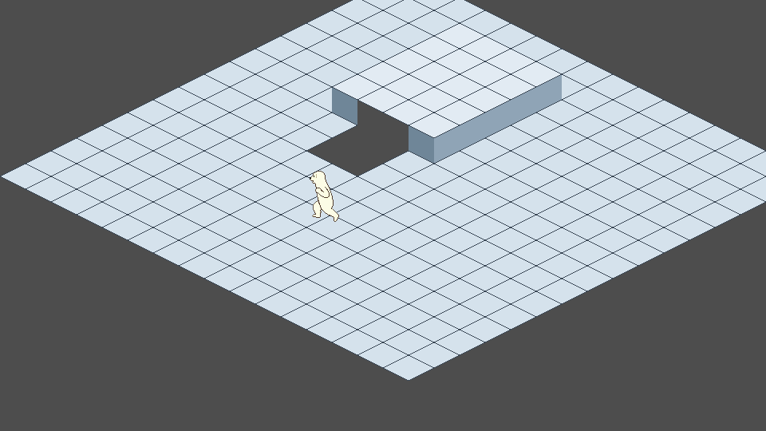

# Polar Adventures

An isometric 16-bit arctic platformer. Godot 4.7.2 · GDScript.

**There is no published Godot build.** The Pages site at
<https://yakov.khalinsky.com/polar-adventures/> still serves the retired Phaser
build. The workflow has been switched to this one — it installs Godot 4.7.2 and
the export templates, gates on the test suite, and publishes the web export —
but it runs on pushes to `main` and this work is not merged, so nothing has been
republished. The export itself is verified: it builds, and the result is the
non-threaded variant, which is the one Pages can serve, since Pages cannot send
the COOP/COEP headers a threaded build needs.

## Status: movement prototype

One hand-authored test level, no enemies, no collectibles and no goal. What
exists is a bear that is good to control on an isometric height field: the
movement model ported from the retired side-view build, the projection that
reinterprets it, and a level format that produces collision *and* geometry from
one description. The terrain is drawn as flat placeholder faces — there is no
tile art yet. The feel of the movement is *measured* rather than asserted.

> "It boots" says nothing about whether the jump is 3.5 hero-heights.



*The one level, captured from the running game. The plateau is 64px of ground
and the dark area beside it is the pit; the bear is walking the lattice. The
terrain is placeholder faces — flat fill with the grid drawn over it — so this
shows the geometry and the projection working, not art.*

## Controls

| Action | Keys |
|---|---|
| Move | <kbd>←</kbd> <kbd>→</kbd> <kbd>↑</kbd> <kbd>↓</kbd> or <kbd>A</kbd> <kbd>D</kbd> <kbd>W</kbd> <kbd>S</kbd> |
| Jump | <kbd>Space</kbd> <kbd>Z</kbd> <kbd>X</kbd> |

Hold jump to go higher, tap it to hop. The keys are **screen** directions and
the lattice axes are the screen **diagonals**, so a single key is a tie between
two lattice axes and resolves by a fixed tie-break; holding two gives the
genuine diagonal (`Hero.direction_from_screen()`). This is how isometric games
driven by a D-pad have always behaved. There is a `debug_toggle` action bound
to <kbd>F1</kbd>, but nothing reads it yet, so it does nothing.

## The jump is derived, not tuned

`src/config/movement.gd` holds two design targets and derives every vertical
constant from them:

```
JUMP_HEIGHT_HEROES = 3.5        HERO_H = 64
APEX_TIME_S        = 0.40       JUMP_HEIGHT_PX = 224
        ↓
GRAVITY_RISE   = 2h/t²  = 2800 px/s²    JUMP_VELOCITY = 2h/t = 1120 px/s
GRAVITY_FALL   = RISE × 1.64            (the ratio IS the sense of weight)
```

Nothing vertical is hand-edited independently, so the arc cannot silently stop
matching its stated apex. The constants keep their meaning under a change to
`HERO_H` because they are restated in hero-relative terms and each is asserted
against what it *means* rather than against a px/s literal: max run is 5
hero-heights/s (320 px/s), top speed takes 0.12s, turn acceleration is exactly
2× ground, air acceleration is 58% of ground, air drag is zero (a jump commits
you), and terminal fall is 16.25 hero-heights/s.

Feel is layered on top of the derived arc: asymmetric gravity, coyote time
(100 ms), a jump buffer (120 ms), and variable height via a velocity **clamp**
rather than a multiplier, because a clamp guarantees a minimum hop while a
multiplier's result depends on when you happened to release. The clamp is
0.5894 of full jump velocity, a closed-form minimum hop of 77.8px (1.22
hero-heights).

One subtlety survives the port unchanged. The constants are continuous-maths
values, but **both engines integrate with semi-implicit Euler at a fixed 60Hz**,
which only reaches ~96% of them. `Movement.simulate_apex_px()` simulates the
integrator (`v += g·dt; y += v·dt`) rather than recording a number somebody
measured once, so the gap is *derived* from the constants and cannot drift away
from them. At 60Hz it predicts 214.667px, 95.8% of the closed form — and the
feel harness, driving the real hero, measures 214.7px. The constant stays as
readable design intent and the gap is documented and asserted, rather than
being fudged to compensate. On Godot the height axis is positive-up (an
elevation), so the same numbers take the opposite sign from the y-down screen
they were written for; the form is otherwise untouched.

The readout below is printed on boot and asserted by the suite, so the two
cannot disagree:

```
apex, closed form  224.0 px
apex, measured     214.7 px   (3.35 hero-heights)
min hop            77.8 px    (1.22 hero-heights)
rise / fall        0.400 s / 0.244 s
run-up to top      0.120 s
gap reach, flat    206.0 px
rock slide         17.1 px
coyote / buffer    100 ms / 120 ms
```

`HERO_H` is 64 and it is the **art's** height, which is the point of it: the
bear spans 61–66px across its eight rotations, because a three-quarter view
shows more vertical extent than a front view — foreshortening, not
inconsistency. 64 is the centre of that range, and it is also the value that
lands a 3.5 hero-height jump on *exactly* 7 diamond-heights of 32.

## The isometric projection seam

`src/config/iso.gd` is the only file that knows the geometry of the view.
Everything else works in screen pixels and asks it to convert. Cell space is
`(u, v)`, a plain square lattice — no diamonds in it. Screen space is pixels,
y down. The projection is what makes the square lattice *look* like a diamond
field:

```
screen.x = (u − v) · HALF_W
screen.y = (u + v) · HALF_H  −  elevation · ELEV_STEP
```

`TILE_W × TILE_H` is 64 × 32, a true 2:1 diamond; a cell's box
`[u ± 0.5] × [v ± 0.5]` maps to a diamond of half-width 32 and half-height 16,
and the four box corners land exactly on its four vertices. `cell_to_screen()`
returns the diamond's **centre** and `screen_to_cell()` **rounds** rather than
floors — a pairing that makes the round trip exact for a cell's own centre,
which the suite asserts over 17 × 17 cells at four elevations.

What the rounding region actually is was **measured, not assumed**. An earlier
draft of the file claimed the upper half of a diamond resolves to the cell
behind it; the suite disproved that on its first run, and the corrected claim is
stronger: a point anywhere inside the diamond resolves to its own cell, and only
past a vertex does it flip to a neighbour. So a ground probe taken inside a
tile's top face needs no correction at all. The real hazard is different, and it
is *circularity*: `screen_to_cell()` needs the elevation and the elevation needs
the cell — which is why the ground probe resolves through the level's own
elevation table rather than through a projection call.

Screen position is **derived here rather than integrated**, and it has to be,
because of what the projection does to motion: moving one cell along `+u` moves
the character right *and down*. A model that integrates screen Y therefore
cannot also have a walkable floor — walking along an axis would drive the
character into the ground it is standing on. `HeightMover` integrates
`(u, v, height)` and calls `Iso.lattice_to_screen()` for a screen position.
`ELEV_STEP` is 1, so elevation *is* height in pixels (it was 32, a step count,
which let "the jump is 224px" and "the jump is 7 steps" drift apart); the height
field's numbers and the movement constants' numbers are now the same numbers.

One rule is worth writing down because it looks like a depth bug while being
something else: elevation must be expressed as **sibling nodes**, never as
`z_index`. Nodes sort against each other only while they share a `z_index`, so
giving one a different one opts it out of y-sorting entirely — the failure is a
hero walking in front of a wall it should be behind.

## The height field

A level is text (`levels/feel-test-01.txt`) parsed by `LevelSource` — the only
file that knows the format — into a `HeightField`: `(cell) → ground height in
pixels`. Collision is a **query**, not a shape overlap. "What is under me",
"can I step up to it" and "am I falling" are all one lookup.

That is forced rather than chosen. In a 2:1 diamond, moving one cell along `+u`
moves the character right and down by half a tile; a flat-topped collision box
puts the floor on a horizontal screen line, so a character walking along an axis
walks down into it. The two cannot both be true — so the level is a height field
instead, and collision is something the character asks about rather than
something it overlaps.

The format is one character per cell, and the legend says what a character
*means*, including its ground height, so the whole level is one diffable plane:

```
[name] feel-test-01
[tile] 64 32
[legend] . empty   0
[legend] # solid   32
[legend] % solid   64
[legend] P spawn   32
[rows]
################
####%%%%########
...
```

The parser **fails loudly, by name, on every malformed input**: a row of the
wrong length, a character not in the legend, no spawn, two spawns, an unknown
`[key]`, a legend line of the wrong shape. Hand-authored text has no compiler,
so the validation pass is worth more than the rest of the file — a ragged right
edge otherwise reads as a hole hundreds of pixels from the typo it really is.

`BuiltLevel.from_source()` is the second seam: it turns a parsed level into the
`HeightField` the renderer and the hero consume, and nothing downstream parses
anything. Cells the level does not describe are **holes, not ground** — a level
is a finite thing and walking off it should be a fall.

Collision and geometry come from the one description. `IsoTerrain` draws every
cell's top face, plus a skirt on whichever camera-facing sides are taller than
the ground behind them, so a cliff shows a tall face and a kerb a short one from
one rule. `side_u_visible()`/`side_v_visible()` are comparisons against the
neighbouring height, not a bitmask: in a diamond the two directions that can
hide a cell *are* grid neighbours, so "above" from the side-view build has no
meaning here and the rule is simpler for it. The colours are placeholders keyed
to height — exact about geometry and provisional about looks, which is the right
way round, because a placeholder that is geometrically wrong teaches nothing.

`HeightMover` will step up at most `STEP_UP` = 12px; anything higher is a wall
and the move is refused. Without that limit, "the ground is above me" and "the
ground is a cliff above me" are the same test and the character walks up
anything.

The one level is a feel-test rig: 16 × 16, 252 cells, the spawn at `(9, 11)` at
height 32, a 4 × 5 plateau at 64, and a 2 × 2 pit. The boot print reports all of
it.

## Running it

```bash
godot --path . --windowed --resolution 1280x720
```

The project is at the repo root, hence `--path .`. The viewport is 960 × 540
with `canvas_items` stretch and **integer** scaling, so the internal image is
only ever scaled by whole numbers and never resampled — at 1080p it is exactly
2×. The renderer is `gl_compatibility`, the texture filter is nearest, and
transforms are snapped to the pixel grid.

There is a static lab for judging the bear **in the projection it will actually
be drawn in** — an isometric grid with the bear standing on it, no physics, no
collision, no camera follow. A 3/4 view that reads well flat can read badly once
it is standing on a diamond, and the only way to find that out is to look:

```bash
godot --path . res://scenes/bear_lab.tscn
```

## Verification

All three run without a display:

```bash
godot --headless --path . --import
godot --headless --path . --script res://tests/run_tests.gd
godot --headless --path . --quit-after 5
```

The second is the suite, and it reports **108 checks**. Its shape is the point:
the measured value is printed on *every* line, pass or fail, so a regression is
self-diagnosing rather than a bare "expected true, got false". There is no
fail-fast — one run reports every regression — and a failure exits non-zero so
CI can gate on it:

```
PASS  JUMP_HEIGHT_PX = 3.5 x HERO_H                        224.0 (expected 224.0 +/- 0.001)
PASS  GRAVITY_RISE = 2h/t^2 (derived)                      2800.0 (expected 2800.0 +/- 0.5)
PASS  screen_to_cell inverts cell_to_screen for every cell 0 (expected 0)
PASS  a ragged row is rejected                             a row one character long
```

The suite's own reporting is a subject too: `report()` returning non-zero on a
failure is asserted, because the runner once returned `true` alongside `quit()`
and discarded the exit code — it printed "1 of 32 checks FAILED" to a shell that
saw success. The third command is a boot smoke test: it loads the level, prints
the level line and exits 0, which catches a scene that throws on load.

Two further harnesses drive the real physics world, and are the acceptance test
for the movement port. Both need `--fixed-fps 60` — without it a run executes an
unpredictable number of physics ticks and the measurements mean nothing:

```bash
godot --headless --fixed-fps 60 --path . --script res://tests/integration/feel_harness.gd
godot --headless --fixed-fps 60 --path . --script res://tests/integration/height_probe.gd
```

The feel harness drives the hero through a fixed script of segments and measures
apex, top speed and slide. The height probe asks whether the `(u, v, height)`
model can carry the movement at all: walking `+u` moves right *and* down, the
jump apex still measures the ported number, a low step is walked up by exactly
its height, a cliff is a wall, and walking off a terrace falls.

Where coverage is **thin**, honestly: nothing tests the art pipeline
(`tools/build_bear.gd`, `tools/measure_limbs.gd`), nothing tests the drawing
(`IsoTerrain`, `IsoGrid`), and nothing tests `level_scene` beyond the boot smoke
test. The pure-logic rules — which acceleration applies, when a turn counts as a
turn — are unit-tested rather than measured in a physics world, deliberately:
measuring the airborne-turn rule by sampling a frame of a real jump failed once
for timing reasons that had nothing to do with the rule.

## Layout

```
src/
  config/    movement.gd (the tuning) and iso.gd (the projection seam)
  level/     level_source.gd (the text format), height_field.gd, build_level.gd
  objects/   height_mover.gd (the model) and hero.gd (input + presentation)
  scenes/    level_scene.gd, iso_terrain.gd, iso_grid.gd, bear_lab.gd
  input/     input_state.gd — the four things the hero reads, in one place
  art/       bear_frames.gd — builds SpriteFrames from the registered strips
tests/
  run_tests.gd, harness.gd
  unit/         seven files of pure checks
  integration/  feel_harness.gd, height_probe.gd and their drivers
tools/       build_bear.gd, measure_limbs.gd, thicken_limbs.gd,
             probe_capabilities.gd, probe_engine.gd, setup_input_map.gd
scenes/      level.tscn (the game), hero.tscn, bear_lab.tscn
levels/      feel-test-01.txt
assets/art/       source/ (PixelLab generations), bear/ (the registered strips)
assets/concepts/  concept art, the logs, the pose work
```

Three seams are deliberate. `iso.gd` is the only file that knows the projection,
so a 2:1-to-4:3 change — or diamond-to-something-else — touches that file and no
player code. `level_source.gd` is the only file that knows the level format, so
swapping in Tiled JSON means changing that file and nothing else.
`HeightMover` is the character, and `Hero` extends it rather than copying it, so
the probe that graded the model measures the thing the game actually runs. The
input seam is the same one the side-view hero had: `hero.input_override` lets a
test or a driver move the bear without a keyboard, so measurements are
independent of the input system and of Godot's event dispatch order.

## Art

The Godot art pipeline is **GDScript tooling, not the retired Node slicer**.
`tools/build_bear.gd` reads PixelLab source generations under
`assets/art/source/bear/<character>/<clip>/<direction>/<n>.png` (a `CURRENT`
file names which character), registers them, and composes one strip per
`(clip, direction)` plus a `layout.json`.

Registration is translation rather than cropping, and it is **not optional**:
the model places each frame independently — on the idle alone the feet move 4px
vertically across four frames, and the body drifts 5px between directions and up
to 8px across them. So the lowest opaque row of each frame goes to a common
ground row and the opaque bbox's centre-x goes to a common centre column. An
**airborne** clip gets one shared translation instead, because planting each
frame on the ground would clamp the leap back onto the floor on exactly the
frames where the bear is highest, deleting the jump. A frame that would not fit
is a named failure, not a clipped leg in the game. A pass also repairs limbs the
model sometimes fills with the outline's near-black, recolouring the interior of
any region thick enough to survive a 5 × 5 solid test — a thickness guard, not
a list of coordinates, so the one-pixel outline and the face are untouched by
construction.

`BearFrames` builds the `SpriteFrames` at **runtime** rather than saving a
`.tres`: a tool-built resource would reference textures the tool had only just
written, and without an import pass in between Godot embeds them inline —
measured at 351KB against 566 bytes for the same asset. Reading the bytes
sidesteps the ordering, so re-running the art build and the game back to back
just works.

`Hero` then plays `<clip>-<facing>` for the four diagonal facings that are the
lattice axes on screen. Two traps are guarded: `play()` is only called when the
animation changes (calling it every frame restarts it and the bear sits on frame
0), and `speed_scale` is reset in every branch because it is per-sprite and
sticky. The bear is drawn facing left in the art's west-ish facings, and there
is no mirroring — the four facings the game uses are all distinct, which
sidesteps the flipped-slice problem the side-view build had to work around.

Two tools exist because "the arms look thin" is an art judgement that is hard to
act on. `tools/measure_limbs.gd` turns it into an arm/leg thickness ratio — the
first bear measured **0.25** (3.0px arms against 12.0px legs), which reads as a
barrel with twigs bolted on. `tools/thicken_limbs.gd` was built and tested to
close that gap, and it is kept but **not used**: every fix was an exclusion that
revealed the next thin detail — the eye and nose first, then the fingers — and
the honest conclusion is that limb thickness is not reachable by any lever
PixelLab exposes (`proportions` has lengths and shoulder span, not thickness)
nor by a morphological pass, so the arms are what they are until someone
redraws them by hand.

`tools/probe_capabilities.gd` and `tools/probe_engine.gd` **ask the engine what
4.7.2 actually offers** rather than trusting reports. Several decisions in the
port were made from second-hand claims about engine limitations — ghost
collisions, broken isometric autotiling, no physics interpolation, an input
edge-detection hazard — and reports age. These read the classes, enums and
project settings out of `ClassDB`, so a limitation is authored around only if it
exists, and a setting this project relies on prints as MISSING rather than as a
silently-ignored line in `project.godot`.

The findings behind all of this are in
[`assets/concepts/ASSET-LOG.md`](assets/concepts/ASSET-LOG.md) (rounds 1–3, the
static art) and
[`assets/concepts/ANIMATION-LOG.md`](assets/concepts/ANIMATION-LOG.md) (the
one-generation-per-pose animation work). Both record the retired Node pipeline —
provenance and measurements, not this build's tooling. Two findings shaped the
art most. **FLUX honours content but ignores numbers and geometry** — asked for
a magenta key colour it returns gray, asked for a 24 × 32 sprite it returns full
illustration detail — so the numbers the game needs are imposed by the slicer,
never requested from the model, and a character and its terrain have to come out
of **one image** to agree on scale. And the sheet's grey backdrop is only nine
levels from the bear's shaded fur (`rgb(165,164,159)` against `rgb(174,177,170)`),
so keying cannot threshold: it floods the backdrop from the border with the navy
outline as a wall. The FLUX hero also lost its green scarf when the game was
resized against a sheet that did not have one — the scarf had existed to
separate a cream bear from snow, and the real fur's hard navy rim does that
already.

## Roadmap

- **Tile art** — the terrain is drawn as flat placeholder faces keyed to height.
  There is no tileset; `IsoTerrain` derives its geometry exactly and is
  provisional only about looks.
- **Animation** — partial. Five clips are registered in all four diagonal
  facings under `assets/art/bear/` — idle (4 frames, 6fps), run (8, 12fps),
  jump (9, 8fps, airborne), fall (4, 6fps, airborne) and land (4, 14fps) — and
  `Hero`'s state machine selects idle, run, jump and fall. `land` is built but
  not yet chosen, and there is no `slide`. The separate FLUX pose work — a
  four-frame run cycle generated, registered and quantised, the other six poses
  (idle ×2, jump, fall, land, slide) not generated, and nothing wired into the
  then-current game — is paused at that gate in ANIMATION-LOG.md.
- **More levels** — there is exactly one, and it is a feel-test rig.
- **Game systems** — no enemies, no collectibles, no goal, no respawn.
- **Ice** — the Phaser build's one mechanic is not ported at all. There is no
  surface concept anywhere in the tree: `HeightField` holds heights and nothing
  else, the legend has no surface field, and the movement constants have a single
  ground set where rock and ice used to move together.
- **One-way platforms** — the Phaser build had ledges; here `one_way` appears
  only in `tools/probe_capabilities.gd`. Godot 4.7's
  `CollisionShape2D.one_way_collision_direction` is the API for it.
- **Web export** — done and live. CI installs Godot 4.7.2 and the export
  templates, gates on the test suite and publishes the web export.

## Continuing this work

[`docs/MIGRATION.md`](docs/MIGRATION.md) carries the state of the port, what is
left in order of size, and the export and CI traps that cost time — including
the two bugs that shipped to the live site because nothing tests a packed build.

## License

No license has been chosen yet, so all rights are reserved by default. Open an
issue if you would like to use any of this.
